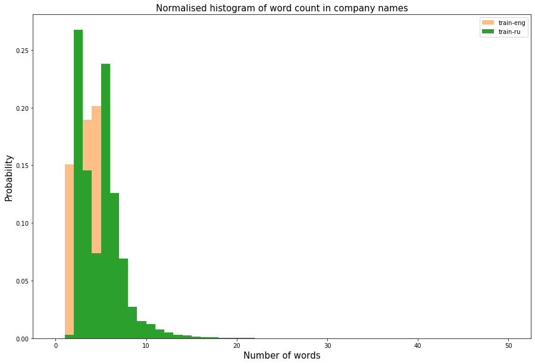

# Решение


 + [Разведочный анализ данных](#EDA)
 + [Предобработка данных](#Preprocessing)
 + [Модель и результаты](#Modeling)
 + [How to Run](#howtorun)


## <a name="EDA"></a> __Разведочный анализ данных__
- Train data - 3983203
- Test data - 996052


Распределения тренировочных данных по лейблам   


|        | ru_name              | eng_name |
| ------------- |:------------------:| -----:|
| Количество уникальных примеров     | 985936    | 499903 |
| Количество уникальных примеров которые встречаются больше 1 раза     | 870046(88.2%) |   498119(99.6%) |
| Максимальное количество повторений одного названия  | 743   |    5572 |
|Количество уникальных примеров с лейблом True | 170839 |  159328|


Wordcloud по столбцу ru_name


Wordcloud по столбцу eng_name


Распределения количества слов к названии компаний



Распределения количества символов к названии компаний


Так же есть пересечение между трейном и тестом.(Думаю это можно в какой то степени считать утечкой данных благодаря которой можно было бы поднять скор) 


|        | ru_name              | eng_name |
| ------------- |:------------------:| -----:|
| Количество уникальных примеров которые есть и в трейне и в тесте    | 35339    | 6646 |


По визуальному анализу данных был сделан вывод что большинство примеров в тренировочных данных  с лейблом __True__ это простая транслитерация с русского на английский, но есть и сложные примеры которые не очевидны.


Сложные примеры
|     ru_name              | eng_name | answer| 
| ------------------:| -----:|-----:|
| Общество с ограниченной ответственностью "АТЛАНТ-СТРОЙ СИСТЕМА"| "Atlant" LLC| False|
|  ООО "ТАГ"    | Troyka Group Limited Liability Company     | True|

Совсем неочевидные примеры
|     ru_name              | eng_name | answer| 
| ------------------:| -----:|-----:|
|  ООО "Стройград"	    | sokjur_2@mail.ru   | True|
|ООО "МД ИНВЕСТМЕНТС" | Limited Liabilitym Company AiHit| True
|РОО "САС" |Public Organization "Union Azerbaijans Togliatti"|True
|ЗАО "Грэта" | INTERFINTECH| True|
|  АО "АГРОСНАБТРАНС"    | JULKIR, ENT.CL, CORP.LTOL     | True|

Примеры на других языках
|     ru_name              | eng_name | answer| 
| ------------------:| -----:|-----:|
|"ФАРР ТУРС/ТРАВЕЛ" (6)7345	 | Dorken Gesellshaft mit beschrankter Haftung | True

## <a name="Preprocessing"></a> __Предобработка данных__

Примеры для предобработки

|     ru_name              | eng_name | answer| 
| ------------------:| -----:|-----:|
|  Общество с ограниченной ответственностью "Торговый дом Ачинск" | Limited Liadility Company "Trade House Achinsk" | True|
| ООО "Красная Пекарня"| 	"Asian-In" Holding Company | False|

### __Заменить заглавные буквы на строчные__

|     ru_name              | eng_name | answer| 
| ------------------:| -----:|-----:|
|  общество с ограниченной ответственностью "торговый дом ачинск" | limited liadility company "trade house achinsk" | True|
| ооо "красная пекарня"	| 	"asian-in" holding company	 | False|

### __Удалить пунктуацию и разбить на токены__
|     ru_name              | eng_name | answer| 
| ------------------:| -----:|-----:|
|  ['общество', 'с', 'ограниченной', 'ответственностью', 'торговый', 'дом', 'ачинск'] | ['limited', 'liadility', 'company', 'trade', 'house', 'achinsk'] | True|
|[ооо, красная, пекарня] | [asian, in, holding, company]	| False|

### __Удаляем часто встречающиеся и стоп слова__
Эти слова либо не несут в себе смысла либо встречаются очень часто. Так же было решено удалить виды организационно-правовых форм по типу 'ООО', так как перевод этих форм можно трактовать по разному.('OOO'=='LTD' и 'OOO'=='LLC'. Оба варианта могут быть верными)   

```
common_rus_words = ['', 'общество', 'c', 'c', 'ограниченной', 'ответственностью', 'ооо', 'акционерное', 'зао', 'закрытое', 'компания', 'комиссия', 'ликвидационная','групп', 'сервис', 'о', 'организация', 'дом', 'оао', 'м', 'открытое', 'сформирована', 'ликвидатора', 'ответственностью', 'назначение', 'ао', 'предприятие', 'а', 'некоммерческая', 'некоммерческое', 'нп', 'общественная', 'ликвидации', 'г', 'ано', 'автономная', 'ассоциация', 'тд', 'торговый', 'лтд', 'ликвидационный', 'ликвидационной', 'ликвидационном', 'р', 'оо', 'ликвидационного']
                

common_eng_words = ['', 'company', 'limited', 'ltd', 'liability', 'llc', 'co', 'of', 'stock', 'joint', 'group', 'the', 'closed', 'open', 'ooo', 'oo', 'jsc', 'cjsc', 'house', 'ограниченной','ответственностью', 'liabiliti', 'public', 'liabilily', 'centre', 'industrial', 'scientific', 'budgetary', 'federal', 'state', 'educational', 'ооо', 'center', 'iiability', 'corporation', 'st', 'kompany', 'global', 'innovations', 'international', 'stok']

common_rus_words = common_rus_words + list(stopwords.words('russian'))
common_eng_words = common_eng_words + list(stopwords.words('english'))
```

|     ru_name              | eng_name | answer| 
| ------------------:| -----:|-----:|
|  ачинск | liadility trade achinsk	 | True|
|красная пекарня | asian holding	| False|


### __Транслитерация__

Транслитерируем *ru_name* на английский и *eng_name* на русский.

|     ru_name              | ru_en_transliteration | answer| 
| ------------------:| -----:|-----:|
|  [ачинск] | [achinsk]	 | True|
|[красная, пекарня] | [krasnaja, pekarnja]		| False|

|     eng_name              | en_ru_transliteration | answer| 
| ------------------:| -----:|-----:|
|  [liadility, trade, achinsk] | [лиадилиты, траде, ачинск]	 | True|
|[asian, holding]	 | [асиан, холдинг]| False|


## <a name="Modeling"></a> __Модель и результаты__

После предобработки данных мы получили более чистые и нужные данные для классификации компаний.

Проблемы
* Несбалансированные классы
    * Это приводит к тому что тяжело придумать правильную стратегию валидации моделей
* Некоторые примеры(описанные в [EDA](#EDA)) очень тяжело классифицировать правильно даже с помощью DL моделей


### __Статистические методы__

Эти модели более надежные так как мы могли протестировать их на всем трейн сете. 

Более подробно: [Similarity Measures for Title Matching](http://cs.uef.fi/sipu/pub/TitleSimilarity-ICPR.pdf)

Сравниваются значения близости слов пары *ru_name* с *en_ru_transliteration* и *eng_name* c *ru_en_transliteration*.

* [__Расстояние Левенштейна__](https://ru.wikipedia.org/wiki/%D0%A0%D0%B0%D1%81%D1%81%D1%82%D0%BE%D1%8F%D0%BD%D0%B8%D0%B5_%D0%9B%D0%B5%D0%B2%D0%B5%D0%BD%D1%88%D1%82%D0%B5%D0%B9%D0%BD%D0%B0)

    Найти минимальное значения между словами в названии компании и ее транслитерации с противоположного языка. 
    
* [__Сходство Джаро-Винклера__](https://ru.wikipedia.org/wiki/%D0%A1%D1%85%D0%BE%D0%B4%D1%81%D1%82%D0%B2%D0%BE_%D0%94%D0%B6%D0%B0%D1%80%D0%BE_%E2%80%94_%D0%92%D0%B8%D0%BD%D0%BA%D0%BB%D0%B5%D1%80%D0%B0)

    Найти максимальное значения между словами в названии компании и ее транслитерации с противоположного языка. 

* [__Сходство Ратклифф-Обершелпа__](https://en.wikipedia.org/wiki/Gestalt_Pattern_Matching)

    Найти максимальное значения между словами в названии компании и ее транслитерации с противоположного языка. 

* [__Расстояние Дамерау-Левенштейна__](https://ru.wikipedia.org/wiki/Расстояние_Дамерау_—_Левенштейна)

    Найти минимальное значения между словами в названии компании и ее транслитерации с противоположного языка. 

* [__Сходство биграмм__](https://ru.wikipedia.org/wiki/N-грамма)

    Найти максимальное значения между словами в названии компании и ее транслитерации с противоположного языка. 

* [__Сходство триграмм__](https://ru.wikipedia.org/wiki/N-грамма)

    Найти максимальное значения между словами в названии компании и ее транслитерации с противоположного языка. 

* [__Косинусный коэффициент__](https://ru.wikipedia.org/wiki/%D0%9A%D0%BE%D1%8D%D1%84%D1%84%D0%B8%D1%86%D0%B8%D0%B5%D0%BD%D1%82_%D0%9E%D1%82%D0%B8%D0%B0%D0%B8)

    Найти максимальное значения между ембедингами слов в названии компании и ее транслитерации с противоположного языка.


### __Результаты методов__


Threshold - пороговое значение для классификации

|Method|Precision|Recall|F1|Threshold|  
| ----:| -------:|-----:|-:|--------:|
|Левенштейн(ru)|0.88|0.63|0.73|1|
|Левенштейн(eng)|0.90|0.63|0.74|1|
|Джаро-Винклер(ru)|0.89|0.74|0.81|0.85|
|Джаро-Винклер(eng)|0.90|0.76|0.82|0.85|
|Ратклифф-Обершелп(ru)|0.88|0.76|0.82|0.70|
|Ратклифф-Обершелп(eng)|0.90|0.78|0.83|0.70|
|Дамерау-Левенштейн(ru)|0.92|0.74|0.82|0.35|
|Дамерау-Левенштейн(eng)|0.92|0.76|0.83|0.35|
|Сходство биграмм(ru)|0.89|0.74|0.81|0.4|
|Сходство биграмм(eng)|0.91|0.75|0.82|0.4|
|Сходство триграмм(ru)|0.83|0.79|0.81|0.25|
|Сходство триграмм(eng)|0.84|0.80|0.82|0.25|
|Косинусный коэффициент(eng)|0.82|0.74|0.80|0.85|


Результаты этих методов показывают что большинство переводов являются в какой то мере транслитерацией слов с русского на английский или наоборот.

Пороговые значения были выбраны исходя из статистических признаков тренировочного датасета.

Далее я обьединил все эти данные что получил высчитывая расстояния и прочие метрики схожести слов и обучил модель классификации на этих данных.

Пример данных для первой пары предложений в тренировочном тесте.


|id|LD_rus|LD_eng	|JW_rus|	JW_eng|	RO_rus|	RO_eng|	DL_rus|	DL_eng|	TG_rus|	TG_eng|	BG_rus|	BG_eng|	CS_eng|	answer|
|-:|-:|-:|-:|-:|-:|-:|-:|-:|-:|-:|-:|-:|-:|-:|
0|	0.135135|	0.135135|	0.500000|	0.500000|	0.222222|	0.222222|	1.000000|	1.000000|	0.000000|	0.000000|	0.000000|	0.000000|	0.439093|	0|

Пробовал разные модели для классификации такие как LogReg, LDA, DT, RandomForest, Catboost, LGBM. Самый лучший результат показала модель RandomForest(40 estimators)
 |Method|Precision|Recall|F1|  
| ----:| -------:|-----:|-:|
|RandomForest|0.92|0.82|0.87|
|Logistic Regression|0.93|0.76|0.84|
|LDA|0.94|0.72|0.82|
|Decision Tree|0.86|0.82|0.84|
|Catboost|0.93|0.81|0.87|

Классификация с помощью сразу нескольких разных методов близости помогает модели ориентироваться сразу в нескольких пространствах что ведет к улучшению результатов.

Так же была идея перевести текст и проделать все то же самое что описано вышес транслитерацией перевода итд, но перевод занял бы слишком много времени ибо Yandex API переводит довольно медленно и есть ограничения на количество символов. Такой подход мог бы поднять F1 скор на 0.1-0.2.

Для моей модели основная проблема в этой задачи стояла в том чтобы поднят recall, но это довольно сложно так как по большей части это все неочевидные либо сложные примеры которые тяжело обработать с помощью такого метода, но при этом такое решения довольно надежное в большинстве случаев и легко интерпретируется. 

Так же из Deep Learning пробовал сиамские модели на основе character ембедингов  для классификации схожести текстов, но результаты были хуже.


## <a name="howtorun"></a> __How to run__

* **solution**
    *   **data**
        * все данные которые можно скачать по [cсылке](https://drive.google.com/drive/folders/1XqYfeVVhyeBvVY8KtQr9hof2gBds0ANX?usp=sharing)
    * **images**
    * *EDA.ipynb* - визуальный анализ данных
    * *Train.ipynb* - pipeline для тренировки модели
    * *черновик.ipynb* - ноутбук для разных экспериментов(там есть код для генерации новых признаков таких как расстояние и близости слов)
    * *rf_kontur.joblib* - модель которую можно скачать по [ссылке](https://drive.google.com/file/d/1iDP_GMSd0YSsNrGU_HrpP33-WP8H3nXo/view?usp=sharing) или натренировать самому
    * *Test.ipynb* -  pipeline для инференса модели на тестовых данных


